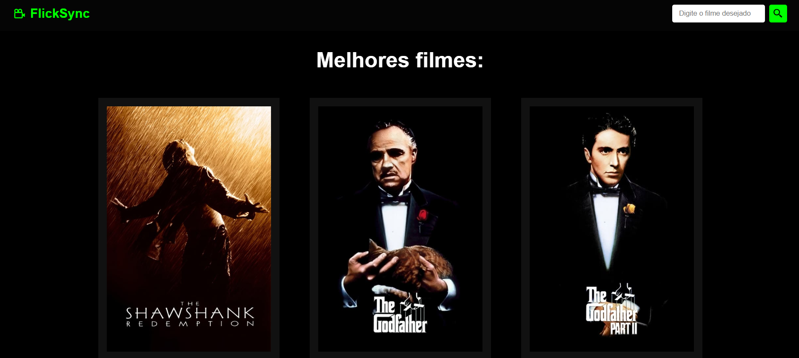

Bem-vindo ao FlickSync!
##https://flicksync.netlify.app/
=========================

FlickSync é uma plataforma online que oferece uma vasta coleção de filmes para os amantes da sétima arte. Com acesso à API do site The Movie Database (TMDb), nosso site proporciona uma experiência única e dinâmica para descobrir e explorar uma ampla variedade de filmes de diferentes gêneros, diretores e atores.

### Principais Recursos:

1.  **Explorar Filmes:**
    
    *   Navegue por uma ampla variedade de filmes, classificados por gênero, popularidade, lançamento e muito mais.
    *   Pesquise filmes específicos por título, gênero, ano de lançamento ou elenco.
2.  **Detalhes do Filme:**
    
    *   Obtenha informações detalhadas sobre cada filme, incluindo sinopse, elenco, equipe de produção, avaliações dos usuários e muito mais.
    *   Veja trailers e pôsteres para ter uma prévia do filme antes de assisti-lo.

    *   Utilizamos a API do The Movie Database para fornecer dados atualizados e precisos sobre filmes, garantindo uma experiência de usuário enriquecedora.

### Tecnologias Utilizadas:

*   **Frontend:**
    
    *   HTML5, CSS3, JavaScript (React.js)
    *   Consumo de API

### Como Iniciar:

1.  Clone o repositório para o seu ambiente local.
2.  Instale as dependências necessárias executando `npm install`.
3.  Obtenha uma chave de API gratuita do TMDb em https://www.themoviedb.org/documentation/api.
4.  Configure sua chave de API no arquivo de configuração.
5.  Inicie o servidor local executando `npm start`.
6.  Acesse o site em seu navegador preferido através do endereço `http://localhost:3000`.

Desfrute da sua jornada cinematográfica 🎬🍿

### Trabalho entregue a disciplina de Desenvolvimento Web 3, da FATEC FRANCA, ministrada pelo prof. Marcio Funes
